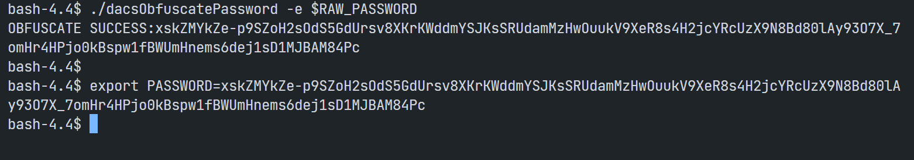
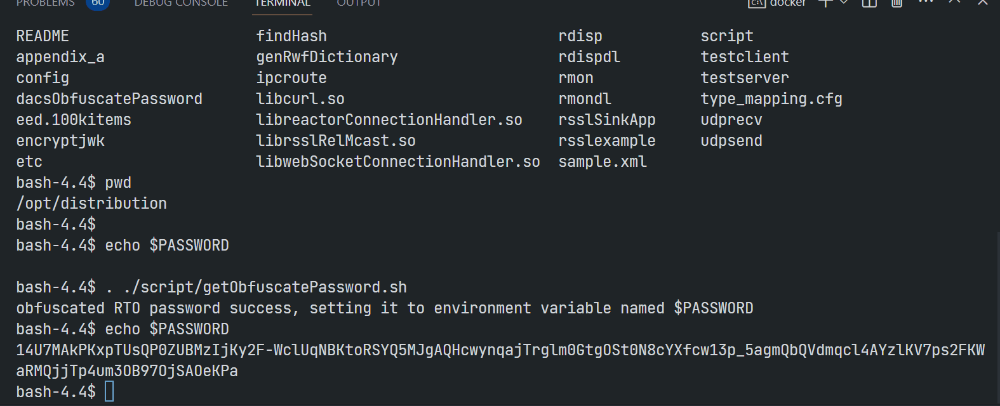
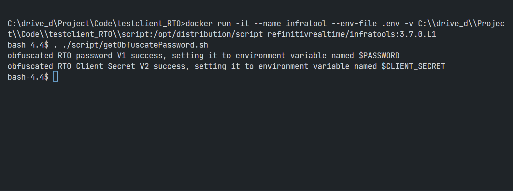

# Testing Refinitiv Real-Time Optimized Connection with the TestClient Tool
- version: 1.0
- Last update: June 2023
- Environment: Windows/Linux
- Prerequisite: [Prerequisite](#prerequisite)

## <a id="intro"></a>Introduction

[Refinitiv Data Platform (RDP)](https://developers.refinitiv.com/en/api-catalog/refinitiv-data-platform/refinitiv-data-platform-apis) gives you seamless and holistic access to all of the Refinitiv content (whether real-time or non-real-time, analytics or alternative datasets), commingled with your content, enriching, integrating, and distributing the data through a single interface, delivered wherever you need it. As part of the Refinitiv Data Platform, the Refinitiv Real-Time - Optimized (RTO) gives you access to best-in-class Real-Time market data delivered in the cloud.  Refinitiv Real-Time - Optimized is a new delivery mechanism for RDP, using the AWS (Amazon Web Services) cloud.

When you got the RTO access credential (either V1 or [V2 Authentication](https://developers.refinitiv.com/en/article-catalog/article/changes-to-customer-access-and-identity-management--refinitiv-re)), you surely want to test the credential and the connection to verify if your environment (Dev, UAT, Production, etc) can access to RTO. The credential test is very simple via few basic cURL commands. However, to real-time streaming connection test is much more complex and you need to run RTSDK RTO Quick Start example application ([C/C++](https://developers.refinitiv.com/en/api-catalog/refinitiv-real-time-opnsrc/rt-sdk-cc/quick-start), [Java](https://developers.refinitiv.com/en/api-catalog/refinitiv-real-time-opnsrc/rt-sdk-java/quick-start#rtsdk-ema-eta-quick-start-connecting-to-refinitiv-real-time-optimized), [C#](https://developers.refinitiv.com/en/api-catalog/refinitiv-real-time-opnsrc/refinitiv-real-time-csharp-sdk/quick-start)) or the [WebSocket API RTO examples](https://github.com/Refinitiv/websocket-api/tree/master/Applications/Examples/RDP).

If you are the developers, using those RTSDK/WebSocket API examples are quite straightforward. However, if you are the System Admin or *just want to test the RTO connection on your environment* setting up the SDK or API environment might be too complicate for what you need. Fortunately, there is the **Refinitiv Real-Time's testclient tool** that can connect and consume real-time data from RTO in a simple command.

This article shows how to use the testclient tool to verify and test the RTO connection (both RSSL and WebSocket) and subscription.

## <a id="whatis_testclient"></a>What is testclient tool?

The testclient tool (formerly known as rmdstestclient) is a general-purpose Refinitiv Real-Time consumer application. The tool is part of the Refinitiv Real-Time Demo Tools package (aka Infrastructure Tools). The testclient basic functionality is to load a list of RICs from a file (or input parameter) and request data of them from Refinitiv Real-Time sources like the RTO, Refinitiv Real-Time Advanced Distribution Server (on-prem ADS), and Real-Time SDK OMM Provider. It supports various Refinitiv Real-Time connection types (RSSL, WebSocket, etc), and various Data Domain data (Market Price, Market By Price, Market By Order, etc). This tool is perfect for verifying the connection and subscription.

You can download the tools package from the [Developer Portal](https://developers.refinitiv.com/en/api-catalog/refinitiv-real-time-opnsrc/rt-sdk-cc/downloads#refinitiv-real-time-sdk-tools) and [my.refinitiv.com](https://my.refinitiv.com/) (Product family "MDS-Infra" and Products "Infrastructure Tools") websites.


If you are using the ADS server, this testclient tool is already in the ADS package (under &lt;ADS package&gt;/&lt;platform&gt;/demo folder).

The tools support the Linux platform and [Docker](https://www.docker.com/). The Docker image is available on [refinitivrealtime/infratools](https://hub.docker.com/r/refinitivrealtime/infratools) Docker Hub repository.


I am demonstrating the tools with Docker on Windows OS and using the infra tools version 3.7.0.L1.

## <a id="prerequisite"></a>Python and PyCharm prerequisite

Before I am going further, there is some prerequisite, dependencies, and libraries that the project is needed.

### Access to the RTO

This project uses RTO access credentials for both Version 1 Authentication (Machine ID type) and Version 2 Authentication (Service ID)

Please contact your Refinitiv representative to help you with the RTO account and services.

### Internet Access

This demonstration connects to RTO on AWS via a public internet.

## Connecting the testclient tool to RTO 

By default, the testclient tools can connect to the RTO with the following basic command and setting.

``` bash
testclient -S ELEKTRON_DD -f <ric file> -authm <oAuthPasswordGrant/oAuthClientCred> -turl $tokenurl -surl $serviceurl -sloc $location -phost $proxyhost -pport $proxyport -ct plugin -pluginName $plugin -u $username -pw $password -rrt -tss -tunnel ssl -I 1
```
- tokenurl=*https://api.refinitiv.com/auth/oauth2/v1/token* (or *https://api.refinitiv.com/auth/oauth2/v2/token*)
- serviceurl=*https://api.refinitiv.com/streaming/pricing/v1/*
- location=RTO location (example: *us-east*, *ap-southeast*, please refer to the [Refinitiv Real-Time - Optimized Installation and configuration for client use](https://developers.refinitiv.com/en/api-catalog/refinitiv-real-time-opnsrc/rt-sdk-java/documentation#refinitiv-real-time-optimized-install-and-config-guide))
- plugin = **libreactorConnectionHandler.so** (RSSL) or **libwebSocketConnectionHandler.so** (WebSocket)
- username = *Machine ID* or *Version 2 Client Id*
- password = obfuscated of the *RTO password* (either Version 1 password or Version 2 Client Secret) using **dacsObfuscatePassword** tool

**Note**: The libcurl.so must be within LD_LIBRARY_PATH

## Using testclient Docker Image

With Docker, you can set the parameters above to the container's environment variables using the ```--env-file``` parameter as follows.

### Step 1: Create Environment Variables file

Firstly, create a file name *.env* in that folder with the following content:

```
# RDP Core Credentials
TOKENURL=https://api.refinitiv.com/auth/oauth2/v1/token
SERVICEURL=https://api.refinitiv.com/streaming/pricing/v1/
LOCATION=ap-southeast
PLUGIN=libreactorConnectionHandler.so
#PLUGIN=libwebSocketConnectionHandler.so
USERNAME=<RTO Machine ID>
RAW_PASSWORD=<RTO Password>
```
If you are using the Version 2 Authentication, your *.env* file should have the following content:

```
TOKENURL=https://api.refinitiv.com/auth/oauth2/v2/token
SERVICEURL=https://api.refinitiv.com/streaming/pricing/v1/
LOCATION=ap-southeast
PLUGIN=libreactorConnectionHandler.so
#PLUGIN=libwebSocketConnectionHandler.so
USERNAME=<RTO Client Id>
RAW_PASSWORD=<RTO Client Secret>
```

**Caution**: You *should not* share a *.env* file to your peers or commit/push it to the version control. You should add the file to the *.gitignore* file to avoid adding it to version control or public repository accidentally.

Note: If you are using Linux OS, you can set the parameters above in your machine's bash profile like the following example:

```bash
$>vi ~/.bash_profile 
...
export TOKENURL=https://api.refinitiv.com/auth/oauth2/v2/token
export SERVICEURL=https://api.refinitiv.com/streaming/pricing/v1/
export LOCATION=ap-southeast
...
$>. ~/.bash_profile #activate the changed
```

### Step 2: Pull and Create Docker Container

The second step is to run the following [Docker run](https://docs.docker.com/engine/reference/run/) command in a command prompt to pull the infra tools Docker image and run its container.

``` bash
docker run -it --name infratool --env-file .env refinitivrealtime/infratools:3.7.0.L1
```

Once the image is pulled and created container successfully, you see the bash command prompt that you are in the infra tools container as follows:


This container contains all infra tools files and libraries you need to connect to RTO.


You can use the ``printenv``` command to check all required parameters are already available in the container.


**Note**: You may be noticed that the ```LD_LIBRARY_PATH``` parameter has been set to the infra tools directly by default. 

### Step 3: Obfuscated Password

The password must first be obfuscated using the supplied *dacsObfuscatePassword* tool with the following command.

``` bash
$>./dacsObfuscatePassword -e $RAW_PASSWORD
```
Then copy the obfuscated result (not include **OBFUSCATE SUCCESS:** text) that prints on the screen and set it as the ```PASSWORD``` parameter with the following command

``` bash
$>export PASSWORD=<obfuscated password from dacsObfuscatePassword>
```


Alternatively, you may create a shell script to run the *dacsObfuscatePassword* tool and set the ```PASSWORD``` parameter for you without a manual copy and set the password. The steps are as follows:

Firstly, create a shell script named ```getObfuscatePassword.sh``` in a ```script``` folder with the following content:

``` bash
#!/bin/sh

#obfuscated password
result=$(./dacsObfuscatePassword -e $RAW_PASSWORD)
#get only obfuscated password from the result
IFS=":" read -ra ADDR <<< $result
#print result, just for checking
#echo "obfuscated password is ${ADDR[1]}"
echo "obfuscated RTO password success, setting it to environment variable named \$PASSWORD"
export PASSWORD=${ADDR[1]}
```

If you are using Docker, you can mount this script folder into a container via the following docker run command:

``` bash
docker run -it --name infratool --env-file .env -v <full path>\\script:/opt/distribution/script refinitivrealtime/infratools:3.7.0.L1
```

Then run the ```. ./script/getObfuscatePassword.sh``` command (please notice a single ```.``` (dot) in front of the command) to set an obfuscated password via the script.


Now the ```PASSWORD``` parameter is ready for use with the testclient tool.

### Step 4: Run the testclient tool to test the RSSL connection

That brings us to running the testclient tool. You can run the testclient tool to connect and subscribe to real-time data from the RTO RSSL connection via the following command

#### RTO with Version 1 Authentication account

To use with the Version 1 Authentication credential, the ```TOKENURL``` parameter must be *https://api.refinitiv.com/auth/oauth2/**v1**/token* URL endpoint and the ```authm``` parameter must be *oAuthPasswordGrant* value. Please note that the Version 1's username is the Machine ID account (GE-A-XXXXXXXX-X-XXXX).

``` bash
$>testclient -S ELEKTRON_DD -il <ric name> -authm oAuthPasswordGrant -turl $TOKENURL -surl $SERVICEURL -sloc $LOCATION -ct plugin -pluginName $PLUGIN -u $USERNAME -pw $PASSWORD -rtt -tss -tunnel ssl -I 1 -X -d 3
```

#### RTO with Version 2 Authentication account

To use with the Version 2 Authentication credential, the ```TOKENURL``` parameter must be *https://api.refinitiv.com/auth/oauth2/**v2**/token* URL endpoint and the ```authm``` parameter must be *oAuthClientCred* value. Please note that the Version 1's username is the Service ID account (GE-XXXXXXXXXXXX).

``` bash
$>testclient -S ELEKTRON_DD -il <ric name> -authm oAuthClientCred -turl $TOKENURL -surl $SERVICEURL -sloc $LOCATION -ct plugin -pluginName $PLUGIN -u $USERNAME -pw $PASSWORD -rtt -tss -tunnel ssl -I 1 -X -d 3
```
Note: You can specify the RICs file name with ```-f <RICs file name>``` instead of ```-il <ric name>``` parameter.

I am demonstrating with the Version 2 Authentication account below::



The commands above use the Service Discovery feature that dynamically connects the testclient tool to the RTO endpoint define in the ```LOCATION``` parameter. If you want to test a connection with a specific endpoint, you can set the endpoint via ```-h``` with RSSL port **14002** via ```-p``` parameters.

``` bash
$>testclient -S ELEKTRON_DD -il <ric name> -authm oAuthClientCred -turl $TOKENURL -p 14002 -h <RTO RSSL Endpoint> -ct plugin -pluginName $PLUGIN -u $USERNAME -pw $PASSWORD -rtt -tss -tunnel ssl -I 1 -X -d 3
```


Note: RTO Hosts are based on each user's permission. Please check with your Refinitiv representative. To retrieve a valid list of RTO endpoints based on your assigned tier, refer to the DNS Names within the Current Endpoints section outlined in the the [Refinitiv Real-Time - Optimized Installation and configuration for client use](https://developers.refinitiv.com/en/api-catalog/refinitiv-real-time-opnsrc/rt-sdk-java/documentation#refinitiv-real-time-optimized-install-and-config-guide) document.

### Step 4.5: Run the testclient tool to test the WebSocket connection

My next point is a WebSocket connection. You can just change the ```PLUGIN``` variable to **libwebSocketConnectionHandler.so** and then use the same testclient command to connect to the RTO WebSocket endpoint.

``` bash
$>export PLUGIN=libwebSocketConnectionHandler.so

# Connecting to Version 1 Authentication (TOKENURL=https://api.refinitiv.com/auth/oauth2/v1/token)
$>testclient -S ELEKTRON_DD -il <ric name> -authm oAuthPasswordGrant -turl $TOKENURL -surl $SERVICEURL -sloc $LOCATION -ct plugin -pluginName $PLUGIN -u $USERNAME -pw $PASSWORD -rtt -tss -tunnel ssl -I 1 -X -d 3

# Connecting to Version 1 Authentication (TOKENURL=https://api.refinitiv.com/auth/oauth2/v2/token)
$>testclient -S ELEKTRON_DD -il <ric name> -authm oAuthClientCred -turl $TOKENURL -surl $SERVICEURL -sloc $LOCATION -ct plugin -pluginName $PLUGIN -u $USERNAME -pw $PASSWORD -rtt -tss -tunnel ssl -I 1 -X -d 3
```
Note: Please see more detail about the different between Version 2 and Version 1 at *#Step 4* above

I am demonstrating the Version 2 authentication below



If you want to test a connection with a specific WebSocket endpoint, you can set the endpoint via ```-h``` with WebSocket port **443** via ```-p``` parameters like the following example:

``` bash
$>export PLUGIN=libwebSocketConnectionHandler.so

$>testclient -S ELEKTRON_DD -il <RIC name> -authm oAuthClientCred -turl $TOKENURL -p 443 -h <WebSocket Endpoint> -ct plugin -pluginName $PLUGIN -u $USERNAME -pw $PASSWORD -rtt -tss -tunnel ssl -I 1 -X -d 3
```
Note: RTO Hosts are based on each user's permission. Please check with your Refinitiv representative. To retrieve a valid list of RTO endpoints based on your assigned tier, refer to the DNS Names within the Current Endpoints section outlined in the [Refinitiv Real-Time - Optimized Installation and configuration for client use](https://developers.refinitiv.com/en/api-catalog/refinitiv-real-time-opnsrc/rt-sdk-java/documentation#refinitiv-real-time-optimized-install-and-config-guide) document.

That covers all I wanted to say about testing the RTO connection using the testclient tool. 

## Bonus: How to check RTO credentials with cURL

As I said earlier the credential test is very simple via a few basic cURL commands. The first command is checking your RTO credentials with the RDP Authentication service as follows:

### Version 1 Authentication

``` bash
curl  -X POST \
  'https://api.refinitiv.com:443/auth/oauth2/v1/token' \
  --header 'Accept: */*' \
  --header 'Content-Type: application/x-www-form-urlencoded' \
  --data-urlencode 'username=<Machine ID>' \
  --data-urlencode 'password=<RTO Password>' \
  --data-urlencode 'client_id=<App Key>' \
  --data-urlencode 'grant_type=password' \
  --data-urlencode 'takeExclusiveSignOnControl=true' \
  --data-urlencode 'scope=trapi'
```

### Version 2 Authentication

``` bash
curl  -X POST \
  'https://api.refinitiv.com:443/auth/oauth2/v2/token' \
  --header 'Accept: */*' \
  --header 'Content-Type: application/x-www-form-urlencoded' \
  --data-urlencode 'client_secret=<Client Secret/Password>' \
  --data-urlencode 'client_id=<Client Id>' \
  --data-urlencode 'grant_type=client_credentials' \
  --data-urlencode 'scope=trapi'
```
Once the HTTP request is successful, you get the RDP/RTO token information based on the version of your RDP Authentication service:
- Version 1 authentication, see [RDP Authorization - All about tokens tutorial](https://developers.refinitiv.com/en/api-catalog/refinitiv-data-platform/refinitiv-data-platform-apis/tutorials#authorization-all-about-tokens)
- Version 2 authentication, see [Getting Started with Version 2 Authentication for Refinitiv Real-Time and Data Platform: Overview](https://developers.refinitiv.com/en/article-catalog/article/getting-started-with-version-2-authentication-for-refinitiv-real) article

That brings us to the next RDP service, the Service Discovery. To retrieve VIPs, an application must call the URL *https://api.refinitiv.com/streaming/pricing/v1/* API endpoint with the access token from the RDP Authentication Service in the request message header. The Service Discovery supports both V1 and V2 access tokens with the same HTTP GET request message.

``` bash
curl  -X GET \
  'https://api.refinitiv.com:443/streaming/pricing/v1/' \
  --header 'Accept: */*' \
  --header 'Authorization: Bearer <access token>'
```
## Summary and Next Step

That brings me to the end of this article. The testclient tool lets developers, and system admin test RTO connection and subscription with a few Linux/docker commands. The tool simplified RTO credentials and connection tests without any SDK/API setup. It helps you troubleshoot connection/subscription issues by isolating between the RTO server side, API/SDK, and network.

### If you are developers

Once the testclient connects and consumes data from the RTO succeed, it means your credentials and environment are ready to connect to the RTO. You can continue with the Refinitiv Real-Time SDK or the WebSocket API RTO examples based on your preference as follows:
- [RTSDK C# Quick Start page](https://developers.refinitiv.com/en/api-catalog/refinitiv-real-time-opnsrc/refinitiv-real-time-csharp-sdk/quick-start)
- [RTSDK C/C++ Quick Start page](https://developers.refinitiv.com/en/api-catalog/refinitiv-real-time-opnsrc/rt-sdk-cc/quick-start)
- [RTSDK Java Quick Start page](https://developers.refinitiv.com/en/api-catalog/refinitiv-real-time-opnsrc/rt-sdk-java/quick-start#rtsdk-ema-eta-quick-start-connecting-to-refinitiv-real-time-optimized)
- [WebSocket API Quick Start page](https://developers.refinitiv.com/en/api-catalog/refinitiv-real-time-opnsrc/refinitiv-websocket-api/quick-start#connecting-to-refinitiv-real-time-optimized)

### If you are developers

Once the testclient connects and consumes data from the RTO succeed, you can configure your RTDS components such as Advanced Distribution Hub (ADH), Advanced Distribution Server (ADS), or Refinitiv Real-Time Connector (RTC) to connect to the RTO as the upstream. Please contact the Refinitiv Real-Time support team if you need more information about the RTDS configurations with RTO.

The testclient tool function is not limited to just verifying your credentials and connection. It can measure latency in the Refinitiv Real-Time Distribution System and has a lot of subscription features (such as batch and view request, etc) to match your test requirements. Please find more detail about the tool's parameters and commands from the Refinitiv Real-Time Demo Tools Operation Manual in the Infra Tools package.

## <a id="ref"></a>References

For further details, please check out the following resources:

* [Refinitiv Real-Time SDK Family](https://developers.refinitiv.com/en/use-cases-catalog/refinitiv-real-time) page on the [Refinitiv Developer Community](https://developers.refinitiv.com/) website
* [WebSocket API](https://developers.refinitiv.com/en/api-catalog/elektron/refinitiv-websocket-api) page
* [Changes to Customer Access and Identity Management: Refinitiv Real-Time - Optimized](https://developers.refinitiv.com/en/article-catalog/article/changes-to-customer-access-and-identity-management--refinitiv-re)
* [Infrastructure Tools Download page](https://developers.refinitiv.com/en/api-catalog/refinitiv-real-time-opnsrc/rt-sdk-cc/downloads#refinitiv-real-time-sdk-tools)
* [Infrastructure Tools Download page at my.refinitiv.com](https://my.refinitiv.com/)
* [Infrastructure Tools Docker Hub page](https://hub.docker.com/r/refinitivrealtime/infratools)
* [Refinitiv Real-Time - Optimized Installation and configuration for client use](https://developers.refinitiv.com/en/api-catalog/refinitiv-real-time-opnsrc/rt-sdk-java/documentation#refinitiv-real-time-optimized-install-and-config-guide) document
* [How to test RTDS WebSocket connection with the testclient tool](https://developers.refinitiv.com/en/article-catalog/article/how-test-elektron-websocket-connection-rmdstestclient-tool) article
* [Testing Real-time Streaming applications with Docker & Refinitiv Real-Time Connector (part 1)](https://developers.refinitiv.com/en/article-catalog/article/testing-real-time-apps-with-docker-and-real-time-connector) article
* [Testing Real-time Streaming applications with Docker & Refinitiv Real-Time Connector (part 2)](https://developers.refinitiv.com/en/article-catalog/article/testing-real-time-apps-with-docker-and-real-time-connector-2) article
* [Configuring adspop docker to connect to Refinitiv Real-Time Optimized](https://developers.refinitiv.com/en/article-catalog/article/introduction-to-the-refinitivrealtime-adspop-docker-image) article


For any question related to this article or the RTO, please use the Developer Community [Q&A Forum](https://community.developers.refinitiv.com/).