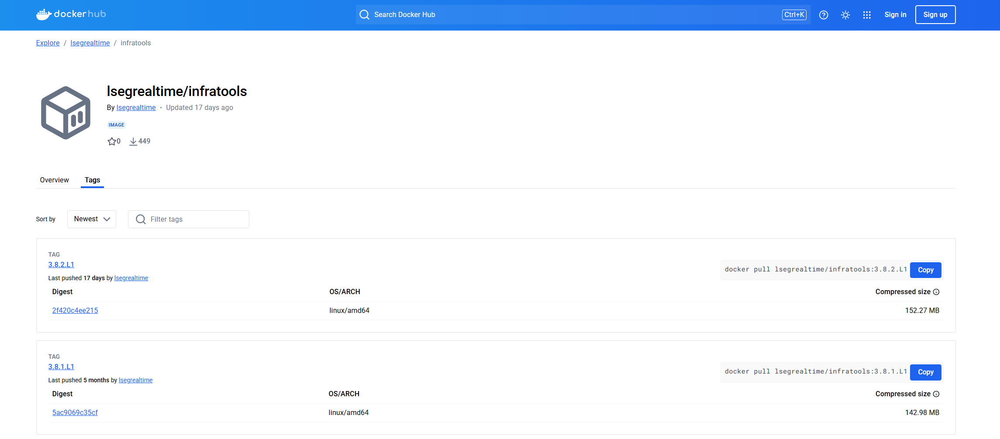

# Testing Refinitiv Real-Time Optimized Connection with the TestClient Tool
- version: 1.0
- Last update: June 2023
- Environment: Windows/Linux
- Prerequisite: [Prerequisite](#prerequisite)

## <a id="intro"></a>Introduction

[Refinitiv Data Platform (RDP)](https://developers.refinitiv.com/en/api-catalog/refinitiv-data-platform/refinitiv-data-platform-apis) gives you seamless and holistic access to all of the Refinitiv content (whether real-time or non-real-time, analytics or alternative datasets), commingled with your content, enriching, integrating, and distributing the data through a single interface, delivered wherever you need it. As part of the Refinitiv Data Platform, the Refinitiv Real-Time - Optimized (RTO) gives you access to best-in-class Real-Time market data delivered in the cloud.  Refinitiv Real-Time - Optimized is a new delivery mechanism for RDP, using the AWS (Amazon Web Services) cloud.

When you got the RTO access credential (either V1 or [V2 Authentication](https://developers.refinitiv.com/en/article-catalog/article/changes-to-customer-access-and-identity-management--refinitiv-re)), you surely want to test the credential and the connection to verify if your environment (Dev, UAT, Production, etc) can access to RTO. The credential test is very simple via few basic cURL commands. However, to real-time streaming connection test is much more complex and you need to run RTSDK RTO Quick Start example application ([C/C++](https://developers.refinitiv.com/en/api-catalog/refinitiv-real-time-opnsrc/rt-sdk-cc/quick-start), [Java](https://developers.refinitiv.com/en/api-catalog/refinitiv-real-time-opnsrc/rt-sdk-java/quick-start#rtsdk-ema-eta-quick-start-connecting-to-refinitiv-real-time-optimized), [C#](https://developers.refinitiv.com/en/api-catalog/refinitiv-real-time-opnsrc/refinitiv-real-time-csharp-sdk/quick-start)) or the [WebSocket API RTO examples](https://github.com/Refinitiv/websocket-api/tree/master/Applications/Examples/RDP).

If you are the developers, using those RTSDK/WebSocket API examples are quite straightforward. However, if you are the System Admin or *just want to test the RTO connection on your environment* setting up the SDK or API environment might be too complicate for what you need. Fortunately, there is the **Refinitiv Real-Time's testclient tool** that can connect and consume real-time data from RTO in a simple command.

This article shows how to use the testclient tool to verify and test the RTO connection (both RSSL and WebSocket) and subscription.

## <a id="whatis_testclient"></a>What is testclient tool?

The testclient tool (formerly known as rmdstestclient) is a general-purpose Refinitiv Real-Time consumer application. The tool is part of the Refinitiv Real-Time Demo Tools package (aka Infrastructure Tools). The testclient basic functionality is to load a list of RICs from a file (or input parameter) and request data of them from Refinitiv Real-Time sources like the RTO, Refinitiv Real-Time Advanced Distribution Server (on-prem ADS), and Real-Time SDK OMM Provider. It supports various Refinitiv Real-Time connection types (RSSL, WebSocket, etc), and various Data Domain data (Market Price, Market By Price, Market By Order, etc). This tool is perfect for verifying the connection and subscription.

You can download the tools package from the [Developer Portal](https://developers.refinitiv.com/en/api-catalog/refinitiv-real-time-opnsrc/rt-sdk-cc/downloads#refinitiv-real-time-sdk-tools) and [my.refinitiv.com](https://my.refinitiv.com/) (Product family "MDS-Infra" and Products "Infrastructure Tools") websites.


If you are using the ADS server, this testclient tool is already in the ADS package (under &lt;ADS package&gt;/&lt;platform&gt;/demo folder).

The tools support the Linux platform and [Docker](https://www.docker.com/). The Docker image is available on [refinitivrealtime/infratools](https://hub.docker.com/r/refinitivrealtime/infratools) Docker Hub repository.



I am demonstrating the tools with Docker on Windows OS and using the infra tools version 3.7.0.L1.

## <a id="prerequisite"></a>Python and PyCharm prerequisite

Before I am going further, there is some prerequisite, dependencies, and libraries that the project is needed.

### Access to the RTO

This project uses RTO access credentials for both Version 1 Authentication (Machine ID type) and Version 2 Authentication (Service ID)

Please contact your Refinitiv representative to help you with the RTO account and services.

### Internet Access

This demonstration connects to RTO on AWS via a public internet.

## Connecting the testclient tool to RTO 

By default, the testclient tools can connect to the RTO with the following basic command and setting.

``` bash
testclient -S ELEKTRON_DD -f <ric file> -authm <oAuthPasswordGrant/oAuthClientCred> -turl $tokenurl -surl $serviceurl -sloc $location -phost $proxyhost -pport $proxyport -ct plugin -pluginName $plugin -u $username -pw $password -rrt -tss -tunnel ssl -I 1
```
- tokenurl=*https://api.refinitiv.com/auth/oauth2/v1/token* (or *https://api.refinitiv.com/auth/oauth2/v2/token*)
- serviceurl=*https://api.refinitiv.com/streaming/pricing/v1/*
- location=RTO location (example: *us-east*, *ap-southeast*, please refer to the [Refinitiv Real-Time - Optimized Installation and configuration for client use](https://developers.refinitiv.com/en/api-catalog/refinitiv-real-time-opnsrc/rt-sdk-java/documentation#refinitiv-real-time-optimized-install-and-config-guide))
- plugin = *libreactorConnectionHandler.so* (RSSL) or *libwebSocketConnectionHandler.so* (WebSocket)
- username = *Machine ID* or *Version 2 Client Id*
- password = obfuscated of the *RTO password* (either Version 1 password or Version 2 Client Secret) using **dacsObfuscatePassword** tool

**Note**: The libcurl.so must be within LD_LIBRARY_PATH

## Using testclient Docker Image

With Docker, you can set the parameters above to the container's environment variables using the ```--env-file``` parameter as follows.

### Step 1: Create Environment Variables file

Firstly, create a file name *.env* in that folder with the following content:

```
# RDP Core Credentials
TOKENURL=https://api.refinitiv.com/auth/oauth2/v1/token
SERVICEURL=https://api.refinitiv.com/streaming/pricing/v1/
LOCATION=ap-southeast
PLUGIN=libreactorConnectionHandler.so
#PLUGIN=libwebSocketConnectionHandler.so
USERNAME=<RTO Machine ID>
RAW_PASSWORD=<RTO Password>
```
If you are using the Version 2 Authentication, your *.env* file should have the following content:

```
TOKENURL=https://api.refinitiv.com/auth/oauth2/v2/token
SERVICEURL=https://api.refinitiv.com/streaming/pricing/v1/
LOCATION=ap-southeast
PLUGIN=libreactorConnectionHandler.so
#PLUGIN=libwebSocketConnectionHandler.so
USERNAME=<RTO Client Id>
RAW_PASSWORD=<RTO Client Secret>
```

**Caution**: You *should not* share a *.env* file to your peers or commit/push it to the version control. You should add the file to the *.gitignore* file to avoid adding it to version control or public repository accidentally.

Note: If you are using Linux OS, you can set the parameters above in your machine's bash profile like the following example:

```bash
$>vi ~/.bash_profile 
...
export TOKENURL=https://api.refinitiv.com/auth/oauth2/v2/token
export SERVICEURL=https://api.refinitiv.com/streaming/pricing/v1/
export LOCATION=ap-southeast
export PLUGIN=libreactorConnectionHandler.so
#export PLUGIN=libwebSocketConnectionHandler.so
export USERNAME=<RTO Client Id>
export RAW_PASSWORD=<RTO Client Secret>
...
$>. ~/.bash_profile #activate the changed
```

### Step 2: Pull and Create Docker Container

The second step is to run the following [Docker run](https://docs.docker.com/engine/reference/run/) command in a command prompt to pull the infra tools Docker image and run its container.

``` bash
docker run -it --name infratool --env-file .env refinitivrealtime/infratools:3.7.0.L1
```

Once the image is pulled and created container successfully, you see the bash command prompt that you are in the infra tools container as follows:


This container contains all infra tools files and libraries you need to connect to RTO.


### Step 3: Obfuscated Password

The password must first be obfuscated using the supplied *dacsObfuscatePassword* tool.

TBD